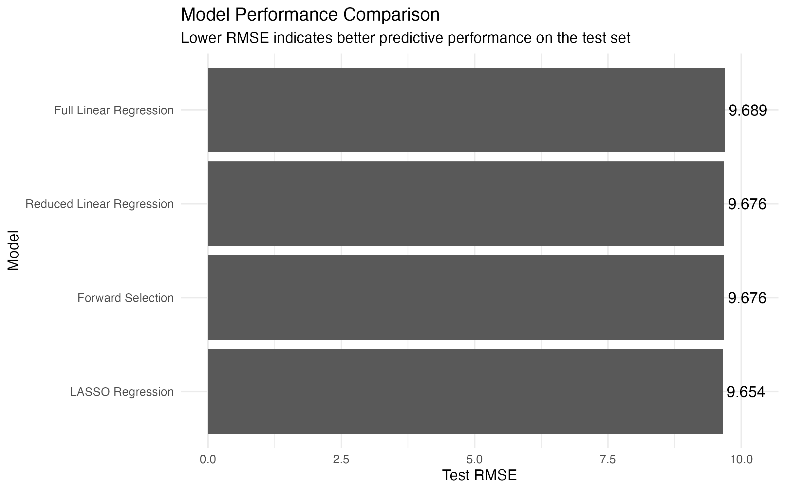

# Steam Game Market Analytics

A product analytics case study in R exploring how Steam game metadata relates to Metacritic scores and critical reception.

## Project Overview

Steam is one of the largest digital distribution platforms for PC games. With thousands of games available, players, publishers, and platform stakeholders often rely on review signals such as Metacritic scores to evaluate game quality and market reception.

This project analyzes Steam game metadata to understand which product features are associated with stronger critical reception and whether structured platform data can provide an early signal of Metacritic performance.

The original version of this project was completed as a university statistical modeling project. This repository rebuilds it into an industry-facing analytics case study with clearer business framing, reproducible code, and actionable interpretation.

## Business Context

For game publishers, developers, and platform analysts, understanding the factors associated with stronger critical reception can support product positioning, pricing strategy, market research, and launch planning.

This project focuses on a practical analytics question:

> How much can structured Steam metadata tell us about a game's critical reception?

Rather than treating the model as a perfect prediction engine, this analysis evaluates both the usefulness and the limitations of metadata-based prediction.

## Key Questions

- Which Steam game attributes are associated with higher Metacritic scores?
- How do price, release timing, recommendation count, and genre categories relate to critical reception?
- Can structured game metadata predict Metacritic scores with reasonable accuracy?
- What are the limitations of using platform metadata to estimate review performance?

## Dataset

The dataset contains Steam game metadata collected through the Steam API and published on Kaggle.

Key variables include:

- `Metacritic`: critic score from 0 to 100
- `ReleaseDate`: game release date
- `RecommendationCount`: number of Steam recommendations
- `PriceInitial`: initial game price
- `IsFree`: whether the game is free
- Genre/category indicators such as `GenreIsAction`, `GenreIsIndie`, `GenreIsAdventure`, `GenreIsStrategy`, and others

## Methods

This project uses R for data cleaning, exploratory data analysis, and predictive modeling.

The workflow includes:

1. Loading and cleaning Steam game metadata
2. Removing invalid or missing Metacritic scores
3. Transforming release dates into usable time-based features
4. Exploring relationships between game attributes and Metacritic scores
5. Building and evaluating regression models
6. Comparing model performance using test RMSE
7. Translating model results into business insights and limitations

## Skills Demonstrated

- Data cleaning and preprocessing in R
- Exploratory data analysis with `tidyverse` and `ggplot2`
- Multiple linear regression
- Forward variable selection
- LASSO regression and regularization
- Train-test split evaluation
- RMSE-based model comparison
- Reproducible analysis using modular R scripts
- Business-oriented interpretation of statistical modeling results

## Modeling Approach

This analysis compares multiple regression-based approaches:

- Full multiple linear regression
- Forward-selected reduced linear regression
- LASSO regression

Model performance was evaluated using RMSE on a held-out test set. The goal was not to build a perfect prediction engine, but to evaluate whether structured Steam metadata can provide a useful directional signal for critical reception.

## Key Results

| Model | Test RMSE |
|---|---:|
| LASSO Regression | 9.654 |
| Forward-Selected Reduced Regression | 9.676 |
| Full Multiple Linear Regression | 9.689 |



The LASSO regression model achieved the lowest test RMSE. However, the forward-selected reduced regression model performed nearly as well while using a simpler and more interpretable structure than the full multiple linear regression model.

Overall, RMSE values around 9.6 to 9.7 Metacritic points suggest that structured Steam metadata can provide rough directional predictions, but it is not precise enough to accurately forecast exact critic scores.

Important drivers of review scores may include factors not captured in the dataset, such as gameplay quality, studio reputation, marketing, technical performance, critic expectations, and launch timing.

## Repository Structure

```text
steam-game-market-analytics/
├── data/
│   ├── raw/
│   └── processed/
├── figures/
├── notebooks/
├── reports/
├── results/
├── scripts/
│   ├── 01_load_clean_data.R
│   ├── 02_eda.R
│   ├── 03_modeling.R
│   └── 04_evaluation.R
└── README.md
```

## How to Reproduce This Analysis

From the project root directory, run the scripts in order:

```bash
Rscript scripts/01_load_clean_data.R
Rscript scripts/02_eda.R
Rscript scripts/03_modeling.R
Rscript scripts/04_evaluation.R
```

Expected outputs include:

- Cleaned dataset in `data/processed/`
- EDA summaries and model results in `results/`
- Visualizations in `figures/`
- Final model comparison outputs from `04_evaluation.R`

## Tools and Packages

- R
- `tidyverse`
- `ggplot2`
- `broom`
- `caret`
- `leaps`
- `glmnet`

## Responsible Interpretation

This project should not be interpreted as a tool that can fully determine whether a game will be critically successful. Metacritic scores are influenced by many qualitative factors that are difficult to capture in structured metadata.

The model is best understood as a market research and decision-support tool, not as a replacement for game quality assessment, user research, or expert review.

## Future Improvements

- Add more product-level features such as publisher, developer, tags, review text, and user review trends
- Compare additional models such as random forest or gradient boosting
- Add cross-validation beyond a single train-test split
- Build an interactive dashboard for exploring genre, price, and release-year patterns
- Expand the business interpretation for publisher or platform strategy use cases

## Project Background and Attribution

This project was originally completed as a group coursework project during my undergraduate studies at UBC. The original analysis focused on predicting Steam games' Metacritic scores using statistical modeling techniques.

This repository is a personal reconstruction and extension of the original project. I rebuilt the project into an industry-facing analytics case study by restructuring the repository, rewriting the business context, improving documentation, expanding the analysis workflow, creating reproducible scripts, and reframing the results for product and market analytics use cases.

Credit is given to the original course project team for the initial project foundation.